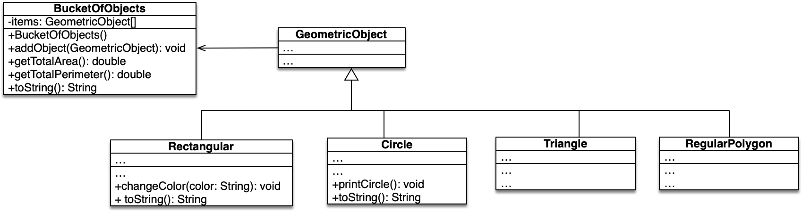

# OOP - WS 2023/24 - Exercise 07

## Object Oriented Programming - 2309 - Prof. Ronny Hartanto

 

---  

### Maximum number of "**commit/push**" for this exercise is **5**
 
> If you commit/push into the repository more than 5 times, you will not get any points for this exercise. 
> Initially, github will create your repository by filling it up with necessary contents. Therefore, you will start with x commits. The commit/push limitation is counted toward your commits, thus you should not exceed the x + 5 commits in total to receive the points for this exercise. 

--- 

## Assignments

  

1. Implement the **Circle** class as depicted in the UML diagram above. Use the description on the slide set. Please refer to UML diagram in exercise 05 for full description of the **GeometricObject** class. 

* the class has three constructors:
    * A no-arg constructor that creates a default circle.
    * A constructor that creates a circle with the specified radius.
    * A constructor that creates a circle with the specified radius, x, y. x, and y are variables for the origin of the circle.
* the *printCircle()* method will print the timestamp when the circle object is created and its radius, e.g., "The circle is created Thu Nov 18 10:25:50 CET 2021 and the radius is 100.0".
* the *toString()* method will return the center coordinate of the circle and its radius, e.g., "(1.00,2.00),r:5.00".

2. Implement the **Rectangular** class as depicted in the UML diagram above. Use the description on the slide. 

* the class has three constructors:
    * A no-arg constructor that creates a default rectangle.
    * A constructor that creates a rectangle with the specified width and height (in the same order).
    * A constructor that creates a rectangle with the specified width, height, x, y, and theta. x, y, and theta are variables for the origin of the first point of the rectangle and orientation with respect to x-axis. Theta is in radians. 
* the *changeColor()* method will replace the filled color of the rectangle object.
* the *toString()* method return the coordinate of the rectangle with the first side aligned to the x-axis for theta equals zero, e.g., rectangle with width=4, height=5, x=0, y=0, and theta=0 will return "(0.00,0.00),(4.00,0.00),(4.00,5.00),(0.00,5.00)".

3. Implement the *BucketOfObject* class as depicted in the UML diagram above. 

* the *getTotalArea()* and *getTotalPerimeter()* methods will return the sum of area / perimeter of all items in stored in the bucket object. 
* the *toString()* method will print the index of the object, type of the object and the *toString()* output of each individual object separated by a colon ':' (one line for each item), e.g.,  

  1:Triangle:(0.00,0.00),(0.00,1.00),(-1.00,1.00)  
  2:Circle:(1.50,2.50),r:5.00  
  3:RegularPolygon:...  
  ...

---

## Instruction
You have to work on your local machine to do this exercise. Don't use the WebIDE as it will use up your "commit/push" tokens. 

**Please follow the following steps:**
1. Clone the repository into your local computer. (you can use terminal or any Git client)
2. Open the local repository on your local computer using your favourite editor (text editor or IDE)
3. Work on your assigment solve all the given problem, make sure they run on your computer. **Don't change the structure of the directory**
4. If you completed all the assigments, *commit* your change to Git and *push* it to the Github (using your GitClient or terminal)
5. Check your submission by visiting your Github repository, after a while you should be able to see the result (:white_check_mark: or :x:)
6. If you have :white_check_mark: then you are done with your exercise, otherwise repeat step 3 onward. 

--- 

## Important

You can ONLY change files inside the **src/main/java** folder and place your name in this readme file. Depending on your task, you might need to create a new class in the **src/main/java** folder. Please don't make any modification anywhere else. 

**Make sure you submit your exercise before the deadline.** 
> If you submit after the deadline, it will not be graded

---
## Notes
* **WS2023/24** The points are not part of the final assessment. This purely exercise to help you learn Java programming.
* The submission will be evaluated automatically (most of the case)!
    * If it doesn't compile, it could be some mistakes on your submission. (no points will be awarded in this case)
* You will receive the points upon successful solving the tasks. 
* You can make or modify your submission before the deadline
* Make sure you don't exceed the limit, sometime it's better to get partial points than exceeding the limit. 
* Use this exercise to practice your programming skill
